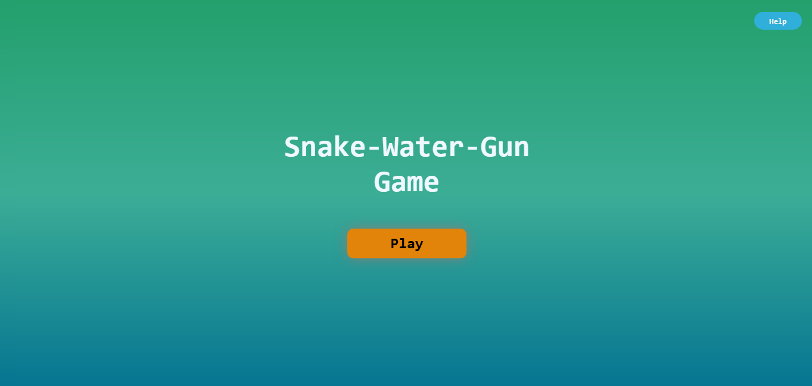
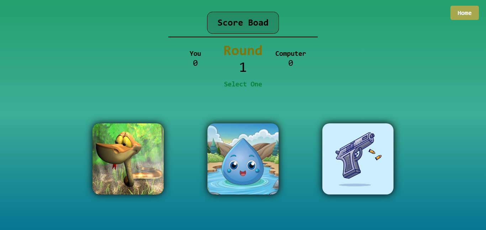
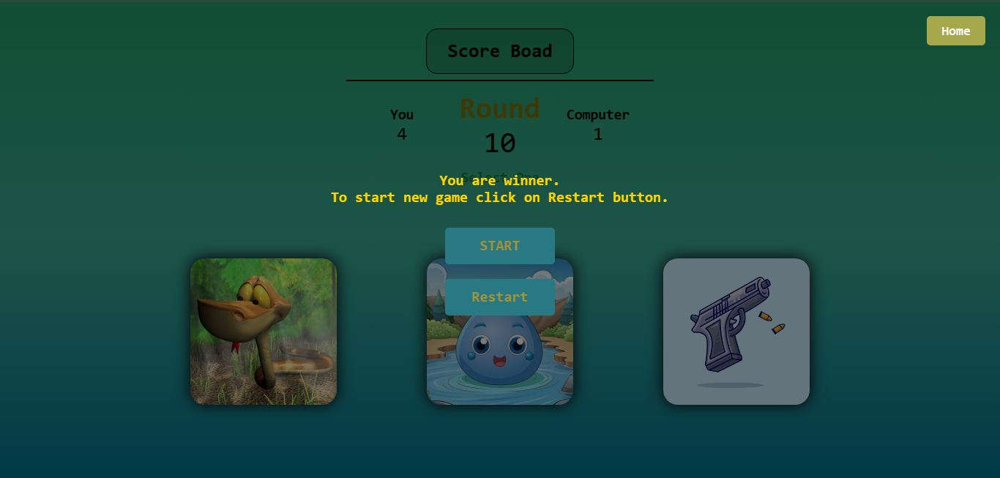

# 🐍 Snake • 💧 Water • 🔫 Gun

A fun and interactive **Snake-Water-Gun game** built using **HTML, CSS, and JavaScript**.

Play against the computer, compete across **10 rounds**, and try to achieve the highest score! 🎮🏆

## 🎮 Live Demo

🚀 **The game is live on GitHub Pages!**

👉 [Snake-Water-Gun](https://abdurrahman1919.github.io/Snake-Water-Gun/)

---

## 📸 Screenshots

### 🏠 Home Screen



### 🎮 Game Screen



### 🏆 Result Screen




---

## 🕹️ About The Game

Snake-Water-Gun is a browser-based game inspired by the classic **Rock-Paper-Scissors** concept.

The player chooses one of three options:

* 🐍 Snake
* 💧 Water
* 🔫 Gun

The computer randomly selects an option, and the game determines the winner based on the rules.

The match consists of **10 rounds**.

---

## ✨ Features

* 🎮 Interactive gameplay
* 🐍 Snake option
* 💧 Water option
* 🔫 Gun option
* 🤖 Computer opponent
* 🔢 10-round game
* 🏆 Score tracking
* 🔄 Restart option
* 🏠 Home option
* ❓ Help section
* 📱 Responsive design
* 🎨 Custom user interface
* ⚡ Fast browser-based gameplay
* 🌐 GitHub Pages deployment

---

## 📜 Game Rules

| Player      | Computer    | Winner   |
| ----------- | ----------- | -------- |
| 🐍 Snake    | 💧 Water    | 🐍 Snake |
| 💧 Water    | 🔫 Gun      | 💧 Water |
| 🔫 Gun      | 🐍 Snake    | 🔫 Gun   |
| Same Choice | Same Choice | 🤝 Draw  |

### 🐍 Snake vs 💧 Water

Snake drinks the water → **Snake wins**

### 💧 Water vs 🔫 Gun

Water damages/drowns the gun → **Water wins**

### 🔫 Gun vs 🐍 Snake

Gun shoots the snake → **Gun wins**

### 🤝 Same Choice

Both choose the same option → **Draw**

---

## 🕹️ How To Play

1. Open the **Live Demo**.
2. Click **Play**.
3. Start the game.
4. Choose **Snake, Water, or Gun**.
5. The computer makes its choice automatically.
6. The winner of the round is displayed.
7. Continue playing through all **10 rounds**.
8. Check the final score and result. 🏆

---

## 🛠️ Technologies Used

### 🌐 HTML5

Used to create the structure of the game.

### 🎨 CSS3

Used for styling, layout, animations, and visual design.

### 📱 Responsive CSS

Used to make the game work across different screen sizes.

### ⚡ JavaScript

Used for:

* Game logic
* Random computer choices
* Score calculation
* Round management
* User interaction
* Result generation
* Game restart functionality

---

## 📂 Project Structure

```text
Snake-Water-Gun/
│
├── 📁 images/
│   └── Game images and screenshots
│
├── 📄 index.html
├── 🎨 SWG.css
├── 📱 responsive.css
├── ⚡ SWG.js
└── 📄 README.md
```

---

## 🎯 Key Concepts Practiced

This project helped me practice:

* HTML5
* CSS3
* Responsive Web Design
* JavaScript
* DOM Manipulation
* Event Handling
* Conditional Statements
* Random Number Generation
* Game Logic
* Score Management
* Git & GitHub
* GitHub Pages

---

## 🚀 Deployment

The project is deployed using **GitHub Pages**.

### 🌐 Live Website

👉 https://abdurrahman1919.github.io/Snake-Water-Gun/

### 💻 Source Code

👉 [View Repository on GitHub](https://github.com/abdurrahman1919/Snake-Water-Gun)

---

## 🔮 Future Improvements

Some ideas for future versions:

* 🔊 Add sound effects
* ✨ Add more animations
* 🏆 Add high-score system
* 📊 Add game statistics
* 🌙 Add Dark/Light mode
* 💾 Save player scores
* 🎨 Add more themes
* 📱 Further improve mobile experience

---

## 👨‍💻 Developer

### Abdul Rahman Amin

A beginner web developer passionate about learning **Python, Web Development, and Software Development**.

🔗 **GitHub:** [@abdurrahman1919](https://github.com/abdurrahman1919)

---

## ⭐ Support

If you like this project, consider giving it a ⭐ on GitHub.

Your support motivates me to keep learning and building more projects! ❤️

---

# 🐍 💧 🔫 Have Fun!

**Choose your move wisely and beat the computer! 🏆**
